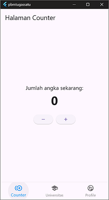
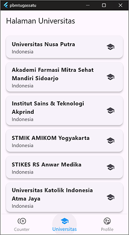
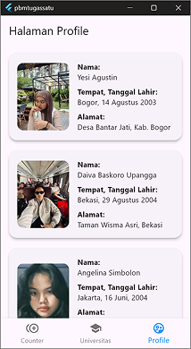

# Aplikasi Flutter 3 Halaman - Kelompok 7

## Anggota Kelompok:

- Nama: Yesi Agustin, NIM: 4522210023
- Nama: Daiva Baskoro Upangga, NIM: 4522210045
- Nama: Angelina Simbolon, NIM: 4522210044

## Deskripsi Aplikasi:

Aplikasi Flutter ini terdiri dari tiga halaman utama, yaitu:

1. **Halaman Counter** – Menampilkan fitur penghitung angka dengan tombol tambah dan kurang.
2. **Halaman API** – Menampilkan data universitas di Indonesia dari API publik.
3. **Halaman Profil** – Menampilkan profil anggota kelompok lengkap dengan foto, nama, TTL, dan alamat.

## Screenshot Halaman:

### Halaman Counter



### Halaman API



### Halaman Profil



## Penjelasan Tiap Halaman:

- **Halaman Counter:**  
  Menampilkan angka yang bisa dinaikkan dan diturunkan menggunakan tombol. Dibuat menggunakan `StatefulWidget` dan `setState` untuk memperbarui tampilan saat angka berubah.

- **Halaman API:**  
  Mengambil dan menampilkan data universitas di Indonesia dari API `http://universities.hipolabs.com/search?country=Indonesia`. Data ditampilkan dalam bentuk kartu (`Card`) dengan dialog untuk detail saat diklik.

- **Halaman Profil:**  
  Menampilkan informasi pribadi masing-masing anggota kelompok, termasuk nama, tempat dan tanggal lahir, alamat, dan foto. Data ditampilkan dalam bentuk daftar kartu.

## Cara Menjalankan Aplikasi:

```bash
flutter pub get
flutter run
```